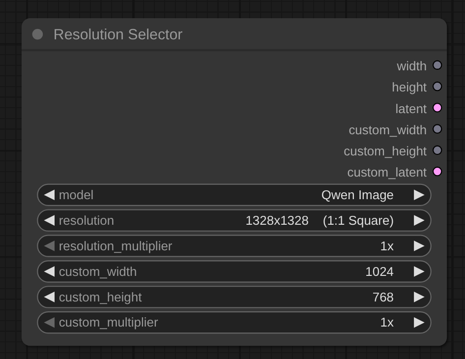

# Resolution Selector Plus for ComfyUI

Custom node for [ComfyUI](https://github.com/comfyanonymous/ComfyUI) providing easy resolution and empty latent selection for image generation workflows.



## Features

### Resolution Selector
- **Model-optimised resolution presets** (portrait, landscape, square)
- **Empty latent output** for direct KSampler connection
- **Custom width/height inputs** with **independent multiplier and latent**

## Installation

```bash
# Change to the directory you installed ComfyUI
cd pathTo/ComfyUI

# Change to the custom_nodes directory
cd custom_nodes

# Clone the repo into custom_nodes
git clone https://github.com/bradsec/ComfyUI_ResolutionSelectorPlus.git

# Restart ComfyUI
```

## Usage

### Resolution Selector Plus

**Add Node:** `Add Node > utils > Resolution Selector Plus`

**Inputs:**
- `model` (dropdown) - Select your image generation model or "All" for all resolutions
- `resolution` (dropdown) - Choose from model-optimized presets with aspect ratios (e.g., "1920x1080 (16:9 Landscape)")
- `resolution_multiplier` (dropdown) - Multiply preset resolution (1x, 2x, 3x, 4x)
- `batch_size` (number) - Number of latent samples to generate (1-64, default: 1)
- `custom_width` (optional) - Override with custom width (0-4096, step 8)
- `custom_height` (optional) - Override with custom height (0-4096, step 8)
- `custom_multiplier` (optional) - Independent multiplier for custom dimensions (1x, 2x, 3x, 4x)
- `custom_batch` (optional) - Number of latent samples for custom resolution (1-64, default: 1)

**Outputs:**
- `width` (INT) - Preset resolution width in pixels
- `height` (INT) - Preset resolution height in pixels
- `latent` (LATENT) - Empty latent tensor for preset resolution (batch_size samples)
- `custom_width` (INT) - Custom width (0 if not set)
- `custom_height` (INT) - Custom height (0 if not set)
- `custom_latent` (LATENT) - Empty latent tensor for custom resolution (custom_batch samples)

**Example Workflows:**

**Basic preset with multiplier:**
```
Resolution Selector Plus (model: SDXL, resolution: "1024x1024 (1:1 Square)", multiplier: 2x)
  → width: 2048, height: 2048
  → latent → KSampler
```

**Custom dimensions with independent multiplier:**
```
Resolution Selector Plus (custom_width: 1024, custom_height: 768, custom_multiplier: 2x)
  → custom_width: 2048, custom_height: 1536
  → custom_latent → KSampler
```

**Using "All" model option:**
```
Resolution Selector Plus (model: All, resolution: "1920x1080 (16:9 Landscape)")
  → Shows all 74 unique resolutions from all models
```

