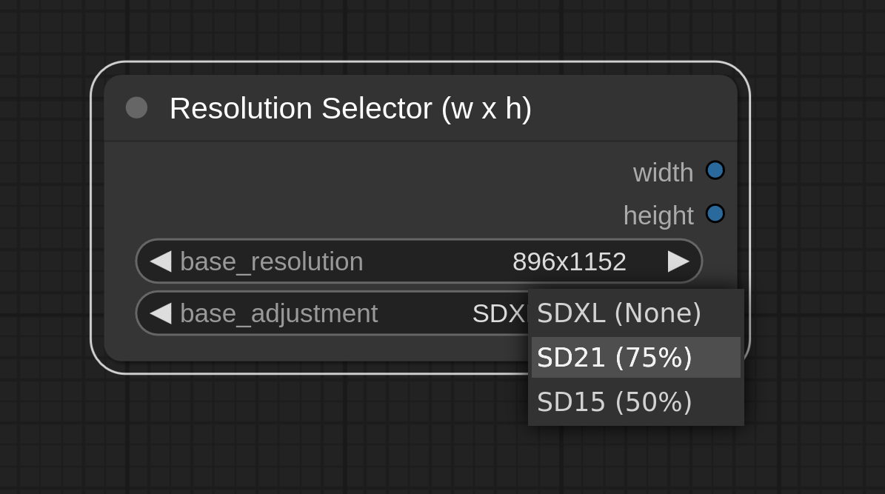

# Custom Node - ResolutionSelector for ComfyUI

Custom image resolution helper node for [ComfyUI](https://github.com/comfyanonymous/ComfyUI)

- Select base SDXL resolution, width and height are returned as INT values.
- If using older model SD 1.5 or SD 2.1 use the base adjustment dropdown. This will adjust (reduce) the base_resolution to suit the model. ie. 1024 (SDXL) will equal 768 in SD21 and 512 in SD15.
- Resolution list based off what is currently being used in the [Fooocus SDXL Web UI](https://github.com/lllyasviel/Fooocus)

### Installation

```
# Change to the directory you installed ComfyUI
cd pathTo/ComfyUI

# Change to the custom_nodes directory
cd custom_nodes

git clone https://github.com/bradsec/ComfyUI_ResolutionSelector.git

# Restart ComfyUI
```

- The new node can be found under:
`Add Node > utils > Resolution Selector (w x h)`


